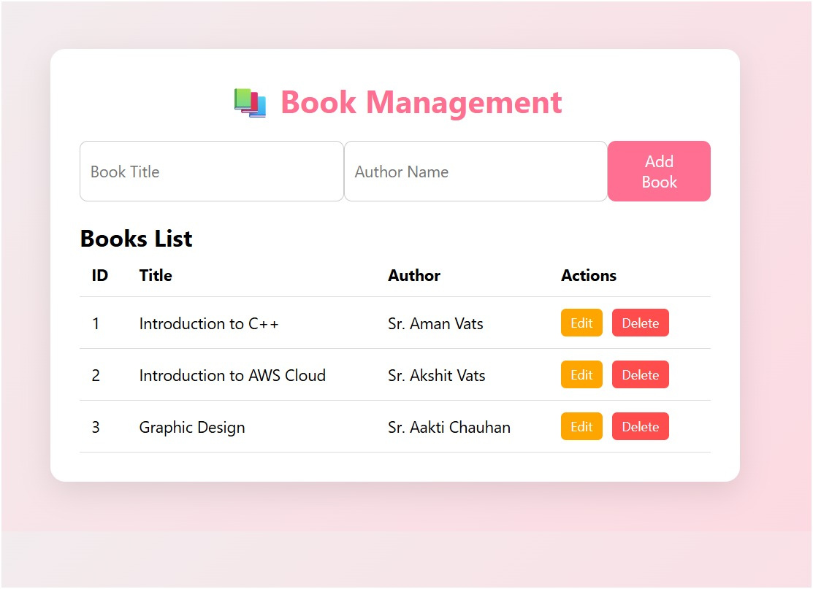

# 📚 Book Management CRUD App

A simple **Book Management System** built with **Spring Boot (Backend)** and **HTML/CSS/JS (Frontend)**.  
Perform **full CRUD operations**: Add, View, Edit, and Delete books with a **beautiful UI/UX**.

---

## 🚀 Features

- ✅ Add new books (Title & Author)  
- ✅ View all books in a **dynamic table**  
- ✅ Edit existing book details **inline**  
- ✅ Delete books with **confirmation**  
- 🌸 Modern **UI with gradient background and animations**  
- 🔗 Fully integrated **REST API** with Spring Boot  
- 🗄️ Uses **H2 in-memory database** (no setup required)  
- ⚡ Responsive and user-friendly design

---

## 🖼️ Screenshots

### Home Page / Book List

<p align="center">
  
</p>

---

## 🛠️ Technology Stack

| Frontend | Backend | Database |
|----------|---------|---------|
| HTML     | Spring Boot (Java 24) | H2 In-Memory |
| CSS      | REST APIs (GET, POST, PUT, DELETE) | JPA/Hibernate |
| JavaScript | Controllers & Repositories | Auto Table Creation |

---

## 💻 How to Run

### 1️⃣ Backend (Spring Boot)
```bash
# Clone the repo
git clone <your-repo-link>

# Open project in IntelliJ
# Run BookcrudApplication.java

# Backend runs on: http://localhost:8085
